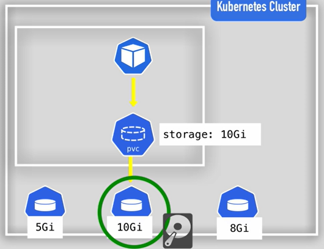
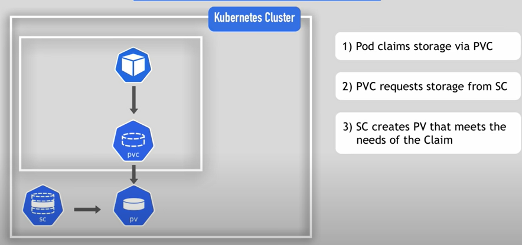

## Kubernetes Volumes
### Persistent Volume (PV)
### Persistent Volume Claim (PVC)
### Storage Class (SC)

- Storage should be configured, so that we can store data generated by pods.
- Storage must be available on all nodes, as we don't know on which node, a pod will restart.
- Storage  needs to survive even if cluster crashes.

## Types of volumes
- Local
    - Voilets:
        - not being tied to specific node
        - surviving cluster crashes
- Remote

### PV
- Cluster Resource
- Created via YAML
    - Kind: PersistentVolume
    - spec: -> how much, mode, accessMode, Mention NFS backend (i.e. actual physical storage.)
- But from where does this storage comes from ?
    - Decide what type of storage we need.
    - And create and manage them by yourself.
- It is like external plugin to cluster.
- can configure multiple storages, like local disk, server, cloud.
- Not Namespaced

## Who creates PV
- K8s Admin sets up and maintain cluster.
    - Configures actual storage
        - nfs storage server
        - cloud storage
- K8s User deploy app in cluster.

### After PV is created by K8s admin, it is needed to be claimed by app, for this user creates PVC

### PVC
- Created via yaml.
- Claim volume of specific size.
- Use Claim in Pod's config.
- Pod request volume using claim.
    -  Claims tries to find volume cluster.
    - Volume is actual storage.
- In same namespace as POD.

- Volume is mounted into POD and then to container in yaml file.

## Storage Class
- Provisions Persistent volumes dynamically.
