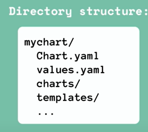

## What is Helm
- Package manager for kubernetes.
- To package YAML files and distribute them in public and private repositories.
- It is a templating engine
    - Can create a template yaml file/ common blueprint
    - and replace dynamic values with placeholder.
- Used when we deploy apps having same kind of config, but only few values are changed.
- Or when need to deploy same app across different envs.
- Release Management
    - Version 2: 2 parts
        - helm CLI
        - helm Server(Tiller): 
            - stores copy of deployment, when it is changed.```shell helm upgrade \<chartname\> ```
            - It has too much power.
            - CRUD can only be done by tiller.
            - So in ```Version 3``` it got removed, due to security reasons.
        - When we deploy helm chart, helm cli send chart to tiller, and tiller executes the request and deploy yaml files to kubernetes cluster.

## Helm Chats
-  Bundle of (pre-configured) YAML files of deployment,configmap, secrets, user etc.
- We can create our own helm charts with Helm and push them to helm repo.


```shell
helm search \<keyword\>
helm install \<chartname\>
helm install --values=my-values.yaml \<chartname\> # Can use this to override values taken from default file.
helm upgrade \<chartname\> 
helm roll-back \<chartname\> 

```

## Helm Chart Structure

- mychart -> Name of chart
    - Chart.yaml : meta info about chart
    - values.yaml : values for template files
    - charts : folder for chart dependencies
    - templates : folder to store template files
    - (optional) Readme and licence.