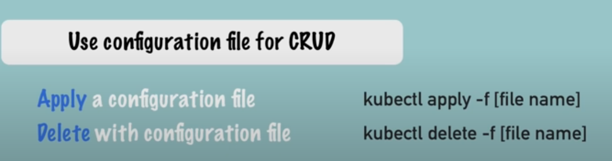

## Install minikube and kubectl
- winget install kubectl
- winget install minikube

### Start Minikube
- minikube start (will download around 700mb files)

### Kubectl commands
- kubectl get pod
- kubectl get services
- kubectl get deployment
- kubectl create deployment mongo-depl --image=mongo  (Creates a deployment named as "mongo-depl" for docker image mongo)

- We will deal with deployment and not pods directly.

- kubectl get replicaset  (Replicaset is created automatically when we create deployment)
- kubectl edit deployment deployment-name (Opens deployment file for editing purpose, if edited, then old pod and replicaset will be deleted and new deployment will be created.)

- kubectl logs pod-name
- kubectl describe pod pod-name
- kubectl exec -it pod-name -- bin/bash
- kubectl delete deployment deployment-name


### Config file
- kubectl apply -f config-file.yaml


```
Deployment
----------
    |
  manages
    |
Replicasets
----------
    |
  manages
    |
   Pods
----------
    |
  manages
    |
 Docker Image
---------------

Everything below deployment is managed by Kubernetes
```


