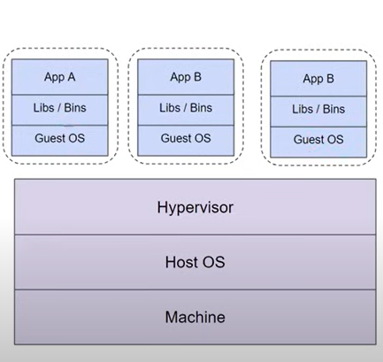
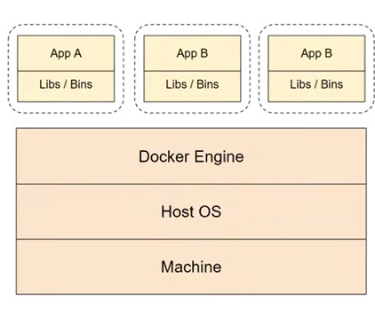

# Docker
- Docker is an open-source platform that allows you to automate the deployment, scaling, and management of applications using containerization.

## Pull Mongo DB Image
    docker pull mongo
    docker pull mongo-express

## Create Docker Network
    docker network ls
    docker network create mongo-net

## Run Containers in Network Created
    docker run -d -p 27017:27017  -e MONGO_INITDB_ROOT_USERNAME=admin -e MONGO_INITDB_ROOT_PASSWORD=password --name mongodb --net mongo-net mongo

    docker run -d -p 8081:8081  -e ME_CONFIG_MONGODB_ADMINUSERNAME=admin -e ME_CONFIG_MONGODB_ADMINPASSWORD=password  -e ME_CONFIG_MONGODB_SERVER=mongodb (it is container name)  --name mongo-express --net mongo-net mongo-express
(can also specify env variables for mongo when starting a container using "-e")

## Install node packages and run
    npm i 
    node server.js

## Image name
docker_domain_registery/image_name:tag

---

# Virtual machines
- VMs act like separate computers inside your computer
- Each virtual machine behaves like a separate computer
- Virtual machines are created and managed by virtualization software
- They provide a flexible and scalable way to utilize hardware resources

---
# Docker Over VM's

|Parameters| Virtual Machines (VMS) |Docker Containers|
|----------|------------------------|-----------------|
|Size| Relatively large and resource-intensive| Lightweight and resource-efficient|
|Startup Time|Longer boot time as full OS needs to start| Almost instant startup as no OS boot required|
|Resource Utilization| Utilizes more system resources (CPU, memory)| Utilizes fewer system resources|
|Isolation|Strong isolation between VMs| Isolated, but shares host OS kernel|
|Portability|Portable, but requires OS compatibility| Highly portable,independent of host OS|
|Scalability |Scaling requires provisioning of new VMs | Easy to scale by creating more containers|
|Ecosystem|VM-specific tools and management frameworks|Docker ecosystem with extensive tooling|
|Development Workflow| Slower setup and provisioning process| Faster setup and dependency management|
|Deployment Efficiency| More overhead due to larger VM size |Efficient deployment with smaller container|

---

# Docker Architecture

- Docker Client: The Docker client is the primary way that users interact with Docker. It accepts commands from the user and communicates them to the Docker daemon. Users can interact with the Docker client through the command-line interface (CLI) or through tools that use the Docker API.
- Docker Daemon: The Docker daemon (dockerd) runs on the host machine and manages Docker objects such as images, containers, networks, and volumes. It listens for Docker API requests and manages Docker objects in response to these requests. The Docker daemon is responsible for building, running, and distributing Docker containers.
- Docker Registries: Docker registries are repositories for Docker images. They can be public or private and allow users to store and share Docker images. The default registry for Docker is Docker Hub, but users can also use other registries such as Amazon ECR, Google Container Registry, or private registries.
    - 
- DockerAPI: The Docker API defines a set of endpoints that correspond to different Docker operations. For example, there are endpoints for managing containers (/containers), images (/images), networks (/networks), volumes (/volumes), and more. Each endpoint accepts different types of HTTP requests (e.g., GET, POST, PUT, DELETE) to perform operations on the corresponding Docker objects.
- Images: Docker images are templates that define the container and its dependencies.
- Containers: Containers are runtime environments created from Docker images.
- Docker Engine: The Docker Engine is the runtime that runs and manages containers
- Dockerfile: A Dockerfile is a file that contains instructions to build a Docker image.
- Docker Hub: Docker Hub is a cloud-based registry that hosts a vast collection of Docker images
