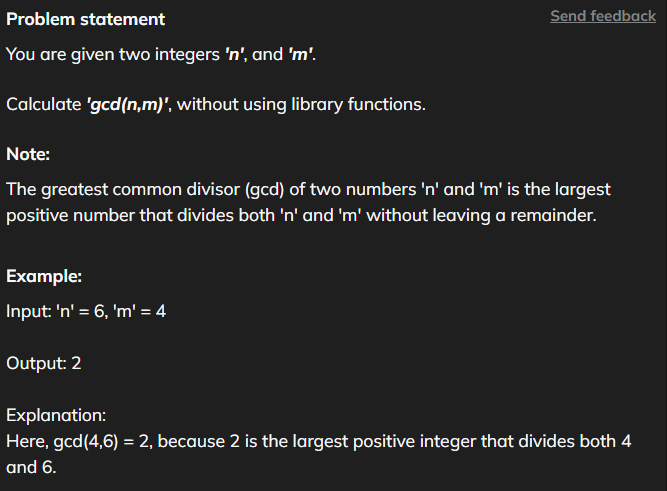
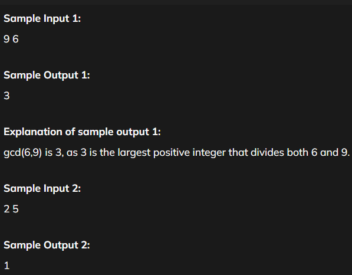

# GCD Or HCF

[Code Link](https://www.naukri.com/code360/problems/hcf-and-lcm_840448?utm_source=striver&utm_medium=website&utm_campaign=a_zcoursetuf&leftPanelTabValue=PROBLEM)



```java
public class Solution {
    public static int calcGCD(int n, int m){

        // Stored in temperory Variable
        int a=n;
        int b=m;


        // Until Both Get Zero
        while(a>0 && b>0){
            if(a>b)
                a=a%b;
            else
                b=b%a;
        }

    // if a is zero return b else a
    if(a==0)
        return b;

    return a;
    }
}
```

# Output


