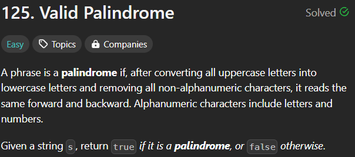
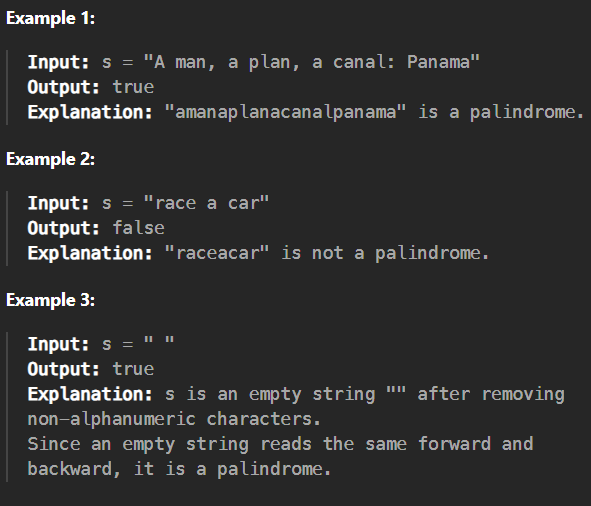

# valid-palindrome

[Code Link](https://leetcode.com/problems/valid-palindrome/description/)

## Problem Statement



## Code Solution

```java
class Solution {
    public boolean isPalindrome(String s) {
        if(s.equals(" ")) return true;
        s = s.replaceAll("[^a-zA-Z0-9]", "").trim().toLowerCase();
        int l=s.length();
        int count=1;
        for(int i=0;i<l;i++){
            if(s.charAt(i) != s.charAt(l-count)) return false;
            count++;
        }
       return true;
    }
}
```

## Output


