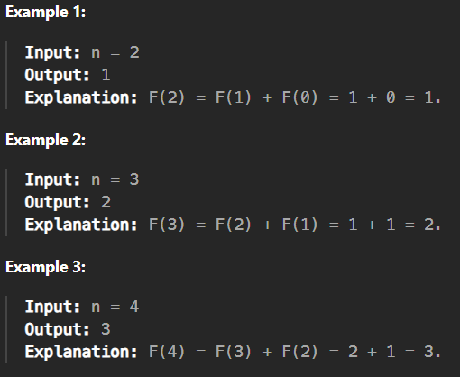

# 509 Fibonacci Series

[Code Link](https://leetcode.com/problems/fibonacci-number/description/)

## Problem Statement


## Code Solution

```java
class Solution {
    public int fib(int n) {
        if(n==0 || n==1) return n;
        else return fib(n-1)+fib(n-2);
    }
}
```

## Output


