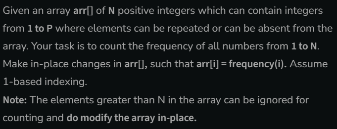

# Frequencies of Limited Range Array Elements

[Code Link](https://www.geeksforgeeks.org/problems/frequency-of-array-elements-1587115620/0)

## Problem Statement



## Code Solution

```java
class Solution{
    //Function to count the frequency of all elements from 1 to N in the array.
    public static void frequencyCount(int arr[], int N, int P) {

        // Used HashMap
        HashMap<Integer,Integer> result= new HashMap<>();

        // Loop to add the element in the HashMap
        for(int i=0;i<N;i++)
            result.put(arr[i],result.getOrDefault(arr[i],0)+1);

        // Checking the element in the map and adding it to the array
        for(int i=0;i<N;i++){
            if(result.containsKey(i+1)){
                arr[i]=result.get(i+1);
            }else{
                arr[i]=0;
            }
        }
    }

}
```

## Output


