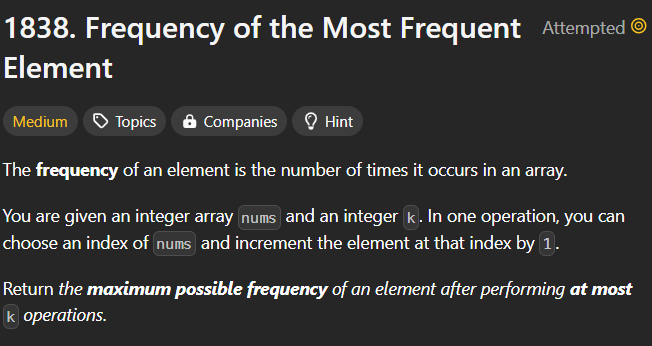
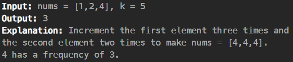

# frequency-of-the-most-frequent-element

[Code Link](https://leetcode.com/problems/frequency-of-the-most-frequent-element/description/)

[Youtube Link](https://www.youtube.com/watch?v=p_RnDTuuhQ0&ab_channel=AlgorithmHQ)

## Problem Statement



## Code Solution

```java
class Solution {
    // YouTube Solution : https://www.youtube.com/watch?v=p_RnDTuuhQ0&ab_channel=AlgorithmHQ
    // Sliding Window Algorithm

    public int maxFrequency(int[] nums, int k) {
        int answer=0;
        int left=0,right=0;
        Arrays.sort(nums);
        long sum=nums[0];

        while(right < nums.length){
            //  greatest_element * (right-left+1) <= k+sum
            if((right-left+1)*nums[right] <= k+sum){
                // Current window Size
                answer=Math.max(answer,(right-left+1));

                // Increment Right Pointer
                right++;

                if(right<nums.length)
                    sum+=nums[right];
            }else{
                sum-=nums[left];
                left++;
            }
        }
        return answer;
    }
}
```

## Output


