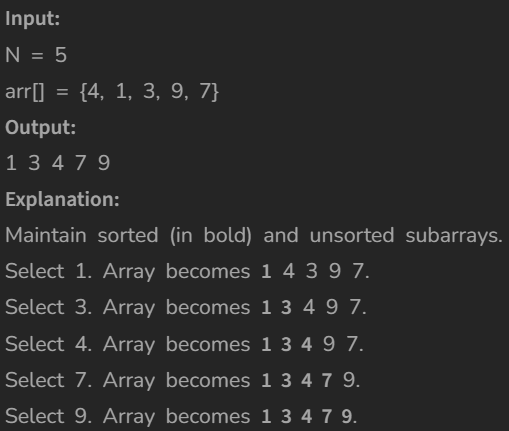

# Selection Sort

[Code Link](https://www.geeksforgeeks.org/problems/selection-sort/1?utm_source=youtube&utm_medium=collab_striver_ytdescription&utm_campaign=selection-sort)

<!-- [Youtube Link](https://www.youtube.com/watch?v=p_RnDTuuhQ0&ab_channel=AlgorithmHQ) -->

## Problem Statement

Given an unsorted array of size N, use selection sort to sort arr[] in increasing order.

## Code Solution

```java
class Solution
{
	int  select(int arr[], int i)
	{
        // code here such that selectionSort() sorts arr[]
        int min=i;
        for(int j=i+1;j<arr.length;j++){
            if(arr[j]<arr[min]){
                min=j;
            }
        }
        return min;
	}

	void selectionSort(int arr[], int n)
	{
	    //code here
	    for(int i=0;i<arr.length;i++){
	        int key=select(arr,i);
	        int temp=arr[i];
	        arr[i]=arr[key];
	        arr[key]=temp;
	    }
	}
}
```

## Output


