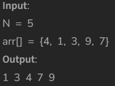

# Merge Sort

[Code Link](https://www.geeksforgeeks.org/problems/merge-sort/1?utm_source=youtube&utm_medium=collab_striver_ytdescription&utm_campaign=merge-sort)

<!-- [Youtube Link](https://www.youtube.com/watch?v=p_RnDTuuhQ0&ab_channel=AlgorithmHQ) -->

## Problem Statement

Given an array arr[], its starting position l and its ending position r. Sort the array using merge sort algorithm.

## Code Solution

```java
class Solution
{
    void merge(int arr[], int l, int m, int r)
    {
         // Your code here
         int n1=m-l+1;
         int n2=r-m;
         
         int[] a=new int[n1];
         int[] b=new int[n2];
         
         for(int i=0;i<n1;i++){
             a[i]=arr[l+i];
         }
         
         for(int i=0;i<n2;i++){
             b[i]=arr[i+m+1];
         }
         
         int i=0,j=0,k=l;
         while(i<n1 && j<n2){
             if(a[i] < b[j])
                arr[k++]=a[i++];
            else
                arr[k++]=b[j++];
         }
         
         while(i<n1)
             arr[k++]=a[i++];
             
         while(j<n2)
            arr[k++]=b[j++];
    }
    void mergeSort(int arr[], int l, int r)
    {
        //code here
        if(l<r){
            int mid=(l+r)/2;
            mergeSort(arr,l,mid);
            mergeSort(arr,mid+1,r);
            merge(arr,l,mid,r);
        }
    }
}
```

## Output

