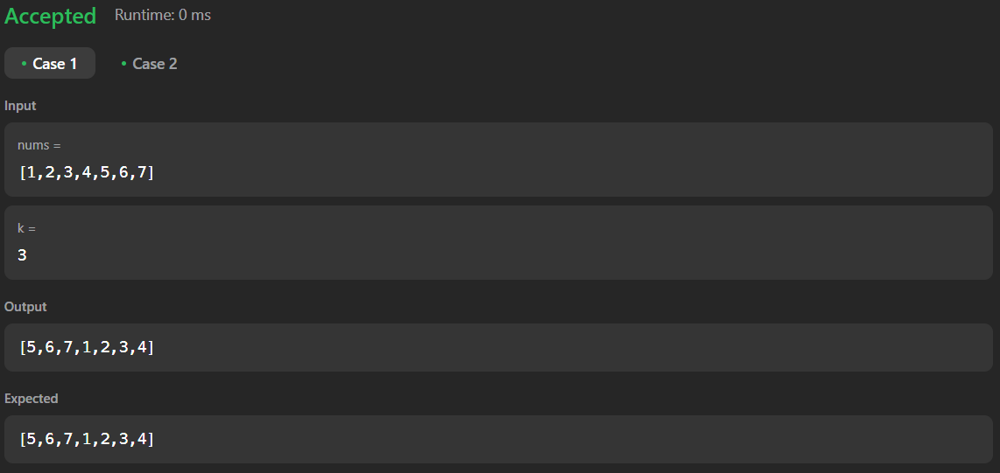

# 189. Rotate Array

[Code Link](https://leetcode.com/problems/rotate-array/description/)

[Youtube Link](https://www.youtube.com/watch?v=TYT5TJSfGlo&ab_channel=Technosage)

## Problem Statement

Given an integer array nums, rotate the array to the right by k steps, where k is non-negative.

Example 1:

Input: nums = [1,2,3,4,5,6,7], k = 3 </br>
Output: [5,6,7,1,2,3,4]</br>

Explanation:</br>
rotate 1 steps to the right: [7,1,2,3,4,5,6]</br>
rotate 2 steps to the right: [6,7,1,2,3,4,5]</br>
rotate 3 steps to the right: [5,6,7,1,2,3,4]</br>

## Code Solution

```java
class Solution {
    // YouTube Solution: https://www.youtube.com/watch?v=TYT5TJSfGlo&ab_channel=Technosage
    public void rotate(int[] nums, int k) {
        // FInding the length of the array
        int n=nums.length;
        
        // It should be in the range of k
        k=k%n;
        
        // We will do it in 3 Steps
        
        // Reverse the whole array
        reverse(nums,0,n-1);

        // Reverse the k elements
        reverse(nums,0,k-1);

        // Reverse the Leftover element
        reverse(nums,k,n-1);

    }


    public static void reverse(int[] nums, int start, int end){
        while(start<=end){
            int temp=nums[start];
            nums[start]=nums[end];
            nums[end]=temp;
            start++;
            end--;
        }
    }
}
```

## Output


