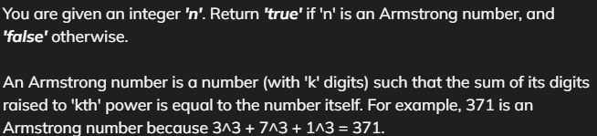
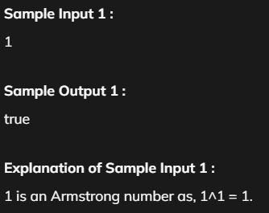
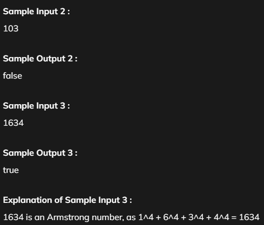

# Check Armstrong

[Code Link](https://www.naukri.com/code360/problems/check-armstrong_589?utm_source=striver&utm_medium=website&utm_campaign=a_zcoursetuf&leftPanelTabValue=PROBLEM)

## Problem Statement



## Code Solution

```java
import java.util.Scanner;
public class Main {

	public static void main(String[] args) {
		// Getting Value
		Scanner sc= new Scanner(System.in);
		int no=sc.nextInt();

		// Assign it to n and one count variable to count the no of digit
		int n=no;
		int count=0;

		// Count the no of digit
		while(n>0){
			count++;
			n=n/10;
		}

		n=no;
		int result=0,rem=0;

		// Extracting the no from the digits
		while(n>0){
			rem=n%10;
			result+=Math.pow(rem,count);
			n=n/10;
		}

		// comparing it with the stored result
		if(result==no){
			System.out.println("true");
		}else{
			System.out.println("false");
		}
	}
}
```

## Output



