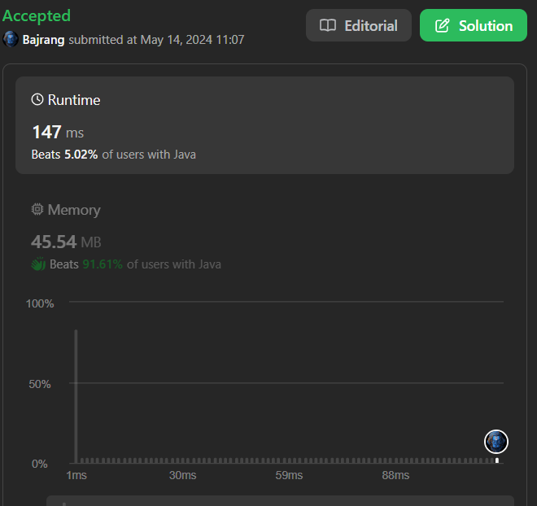
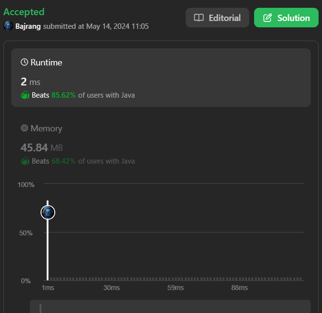
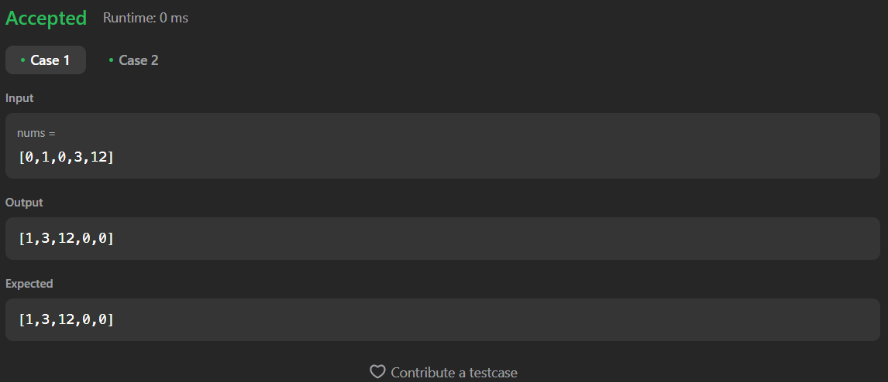

# 189. Rotate Array

[Code Link](https://leetcode.com/problems/rotate-array/description/)

[Youtube Link](https://www.youtube.com/watch?v=TYT5TJSfGlo&ab_channel=Technosage)

## Problem Statement

Given an integer array nums, rotate the array to the right by k steps, where k is non-negative.

Example 1:

Input: nums = [1,2,3,4,5,6,7], k = 3 </br>
Output: [5,6,7,1,2,3,4]</br>

Explanation:</br>
rotate 1 steps to the right: [7,1,2,3,4,5,6]</br>
rotate 2 steps to the right: [6,7,1,2,3,4,5]</br>
rotate 3 steps to the right: [5,6,7,1,2,3,4]</br>

## Code Solution

### Brute Force

```java
class Solution {
    public void moveZeroes(int[] nums) {
        List<Integer> answer=new ArrayList<Integer>();

        int counter=0;

        for(int i=0;i<nums.length;i++){
            if(nums[i]==0){
                counter++;
                continue;
            }
            answer.add(nums[i]);
        }

        for(int i=0;i<counter;i++){
            answer.add(0);
        }

        int[] answerArray=new int[answer.size()];
        for(int i=0;i<answer.size();i++){
            nums[i]=answer.get(i);
            System.out.print(nums[i]+" ");
        }
    }
}
```

### Output Analysis


### Optimum Solution

```java
class Solution {
    public void moveZeroes(int[] nums) {
        int j=0;
        for(int i=0;i<nums.length;i++){
            if(nums[i]!=0){
                int temp=nums[i];
                nums[i]=nums[j];
                nums[j]=temp;
                j++;
            }
        }
    }
}
```

### Output Analysis


## Output



