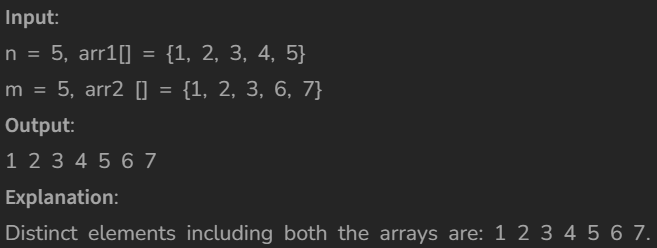

# Union of Two Sorted Arrays

[Code Link](https://www.geeksforgeeks.org/problems/union-of-two-sorted-arrays-1587115621/1?utm_source=youtube&utm_medium=collab_striver_ytdescription&utm_campaign=union-of-two-sorted-arrays)

<!-- [Youtube Link](https://www.youtube.com/watch?v=TYT5TJSfGlo&ab_channel=Technosage) -->

## Problem Statement

Given two sorted arrays of size n and m respectively, find their union. The Union of two arrays can be defined as the common and distinct elements in the two arrays. Return the elements in sorted order.

## Code Solution

```java
class Solution
{
    //Function to return a list containing the union of the two arrays.
    public static ArrayList<Integer> findUnion(int arr1[], int arr2[], int n, int m)
    {
        ArrayList<Integer> answer = new ArrayList<>();
        // it will add the element in sorted form and no duplication
        TreeSet<Integer> set=new TreeSet<>();
        for(int e:arr1)
            set.add(e);
        for(int e:arr2)
            set.add(e);
        answer.addAll(set);
        return answer;
    }
}
```

## Output


