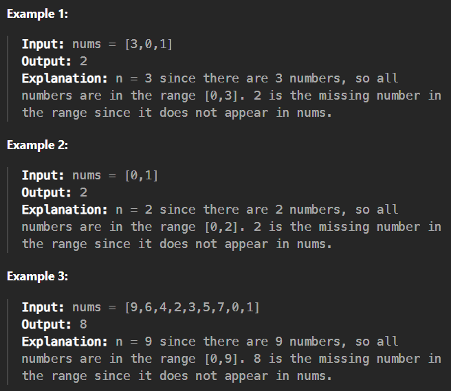

# 268. Missing Number

[Code Link](https://leetcode.com/problems/missing-number/description/)

<!-- [Youtube Link](https://www.youtube.com/watch?v=TYT5TJSfGlo&ab_channel=Technosage) -->

## Problem Statement

Given an array ```nums``` containing ```n``` distinct numbers in the range ```[0, n]```, return the only number in the range that is missing from the array.

## Code Solution Brute Force

```java
class Solution {
    public int missingNumber(int[] nums) {
        Arrays.sort(nums);
        int n=nums.length;
        for(int i=0;i<n;i++){
            if(i!=nums[i]){
                return nums[i]-1;
            }
        }
        return n;
    }
}
```
## Output-1


## Code Solution Optimum

```java
// Example
// 3 0 1
// 3 + 0 - 3 = 0
// 0 + 1 - 0 = 1
// 1 + 2 - 1 = 2

class Solution {
    public int missingNumber(int[] nums) {
        int n=nums.length;
        for(int i=0;i<nums.length;i++)
            n+=i-nums[i];
        return n;
    }
}
```
## Output-2


## Output



