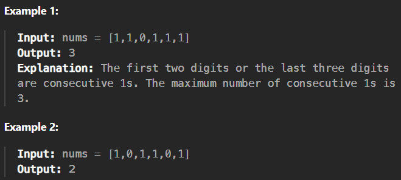

# max-consecutive-ones

[Code Link](https://leetcode.com/problems/max-consecutive-ones/description/)

<!-- [Youtube Link](https://www.youtube.com/watch?v=TYT5TJSfGlo&ab_channel=Technosage) -->

## Problem Statement

Given a binary array `nums`, return the maximum number of consecutive `1`'s in the array.

## Code Solution

```java
class Solution {
    public int findMaxConsecutiveOnes(int[] nums) {
        // Length
        int length=nums.length;

        // Count and answer
        int count=0,answer=0;

        // Loop to iterate 1 and 0
        for(int i=0;i<length;i++){

            // if it has 1 then increment counter
            if(nums[i] == 1) count++;
            // else change the counter to 0
            else count=0;

            // check the max count value or else update it
            answer=Math.max(answer,count);
        }
        return answer;
    }
}
```

## Output


