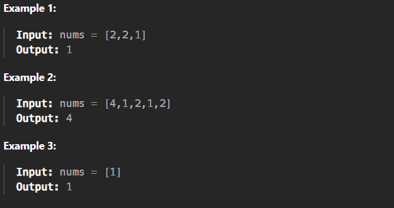

# Single Number

[Code Link](https://leetcode.com/problems/single-number/description/)

<!-- [Youtube Link](https://www.youtube.com/watch?v=TYT5TJSfGlo&ab_channel=Technosage) -->

## Problem Statement

Given a <b>non-empty</b> array of integers `nums`, every element appears <i>twice</i> except for one. Find that single one.

You must implement a solution with a linear runtime complexity and use only constant extra space.

## Code Solution

```java
class Solution {
    public int singleNumber(int[] nums) {
        //since XOR with 0 returns same number
        int ans=nums[0]; 
        int i=0;
        while(i < nums.length-1){
            // ans = (ans) XOR (array element at i)
            ans=ans^nums[i+1]; 
            i++;
        }
        return ans;
    }
}
```

## Output


