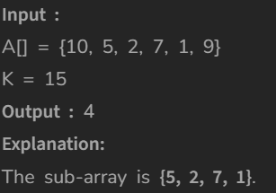

# Longest Sub-Array with Sum K

[Code Link](https://www.geeksforgeeks.org/problems/longest-sub-array-with-sum-k0809/1?utm_source=youtube&utm_medium=collab_striver_ytdescription&utm_campaign=longest-sub-array-with-sum-k)

<!-- [Youtube Link](https://www.youtube.com/watch?v=TYT5TJSfGlo&ab_channel=Technosage) -->

## Problem Statement

Given an array containing N integers and an integer K., Your task is to find the length of the longest Sub-Array with the sum of the elements equal to the given value K.

## Code Solution

```java
class Solution{


    // Function for finding maximum and value pair
    public static int lenOfLongSubarr (int A[], int N, int K) {
        //Complete the function
        HashMap<Integer,Integer> log=new HashMap<>();
        int maxLength=0;
        int sum=0;

        for(int i=0;i<N;i++){
            // Done the sum
            sum+=A[i];

            // Checking that sum and K is same or not
            if(sum == K)
                // Adding the array index+1 as the maxlength
                maxLength=Math.max(maxLength,i+1);

            if(log.containsKey(sum-K))
                // Checking with the value present in the HashMap
                maxLength=Math.max(maxLength,(i-log.get(sum-K)));

            if(!log.containsKey(sum)){
                log.put(sum,i);
            }

        }
        return maxLength;
    }


}
```

## Output


