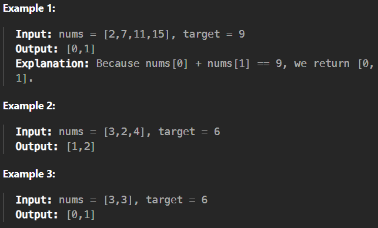

# 1. Two Sum

[Code Link](https://leetcode.com/problems/two-sum/description/)

<!-- [Youtube Link](https://www.youtube.com/watch?v=TYT5TJSfGlo&ab_channel=Technosage) -->

## Problem Statement

Given an array of integers ```nums``` and an integer ```target```, return indices of the two numbers such that they add up to ```target```.

You may assume that each input would have exactly one solution, and you may not use the same element twice.

You can return the answer in any order.

## Code Solution

```java
class Solution {
    public int[] twoSum(int[] nums, int target) {
        int n=nums.length;
        for(int i=0;i<n;i++){
            for(int j=i+1;j<n;j++){
                if(nums[i]+nums[j]==target)
                    return new int[]{i,j};
            }
        }
        return new int[]{};
    }
}
```

## Output


