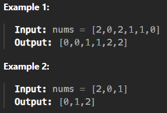

# 75. Sort Colors

[Code Link](https://leetcode.com/problems/sort-colors/description/)

<!-- [Youtube Link](https://www.youtube.com/watch?v=TYT5TJSfGlo&ab_channel=Technosage) -->

## Problem Statement

Given an array `nums` with `n` objects colored red, white, or blue, sort them in-place so that objects of the same color are adjacent, with the colors in the order red, white, and blue.

We will use the integers `0`, `1`, and `2` to represent the color red, white, and blue, respectively.

You must solve this problem without using the library's sort function.

## Code Solution

```java
class Solution {
    public void sortColors(int[] nums) {
        int n=nums.length;
        for(int i=0;i<n;i++){
            for(int j=0;j<n;j++){
                if(nums[i]<nums[j]){
                    int temp=nums[i];
                    nums[i]=nums[j];
                    nums[j]=temp;
                }
            }
        }
    }
}
```

## Output


