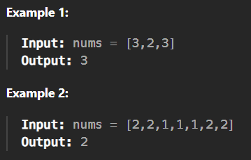

# 169. Majority Element

[Code Link](https://leetcode.com/problems/sort-colors/description/)

<!-- [Youtube Link](https://www.youtube.com/watch?v=TYT5TJSfGlo&ab_channel=Technosage) -->

## Problem Statement

Given an array `nums` of size `n`, return the majority element.

The majority element is the element that appears more than `⌊n / 2⌋` times. You may assume that the majority element always exists in the array.

## Code Solution - 1

```java
class Solution {
    public int majorityElement(int[] nums) {
        Arrays.sort(nums);
        int half=nums.length/2;
        return nums[half];

    }
}
```

## Code Solution - 2

```java
class Solution {
    public int majorityElement(int[] nums) {
        int n=nums.length;
        int half=n/2;
        HashMap<Integer,Integer> check=new HashMap<>();

        for(int i=0;i<n;i++){
            check.put(nums[i],check.getOrDefault(nums[i],0)+1);
            if(check.get(nums[i]) > half) return nums[i];
        }
        return 1;
    }
}
```

## Output


