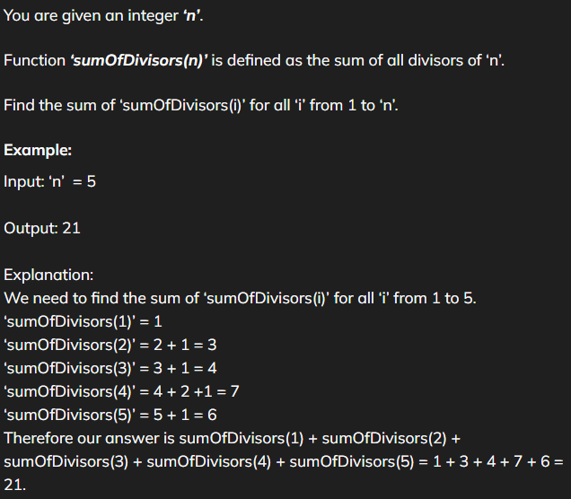
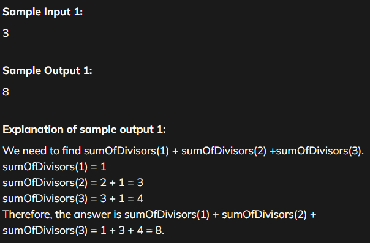

# Sum of all divisors

[Code Link](https://www.naukri.com/code360/problems/sum-of-all-divisors_8360720?utm_source=striver&utm_medium=website&utm_campaign=a_zcoursetuf)

## Problem Statement



## YouTube Solution

[Amazing YouTube Solution](https://www.youtube.com/watch?v=UmzdzwsAsLg&ab_channel=GeeksforGeeksPractice)

## Code Solution

```java
public class Solution {
    public static int sumOfAllDivisors(int n){
        // We will use contribution
        int sum=0;

        // We will add the total occurance
        for(int i=1;i<=n;i++){
            sum+=(n/i)*i;
        }

        // Return total sum
        return sum;
    }
}
```

## Output


