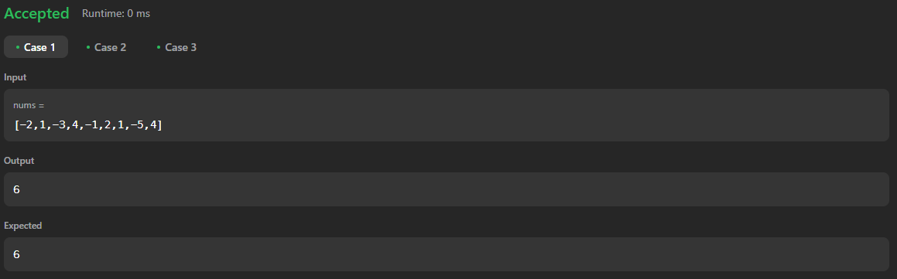

# 53. Maximum Subarray

[Code Link](https://leetcode.com/problems/maximum-subarray/description/)

[Youtube Link](https://www.youtube.com/watch?v=usxn9PV6Fdo&ab_channel=Technosage)

## Problem Statement

Given an integer array `nums`, find the
<a>subarray</a>
with the largest sum, and return its sum.

This problem is misleading - The only thing we have to do in this code is to find the maximum sum among the whole array

## Code Solution

```java
class Solution {
    public int maxSubArray(int[] nums) {
        int sum=0;
        int max_sum=nums[0];
        for(int i=0;i<nums.length;i++)   {
            sum+=nums[i];
            if(sum>max_sum) max_sum=sum;
            if(sum < 0){
                sum=0;
            }
        }
        return max_sum;
    }
}
```

## Output


