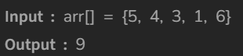

# Max sum in sub-arrays

[Code Link](https://www.geeksforgeeks.org/problems/max-sum-in-sub-arrays0824/0?category&utm_source=youtube&utm_medium=collab_striver_ytdescription&utm_campaign=max-sum-in-sub-arrays)

<!-- [Youtube Link](https://www.youtube.com/watch?v=usxn9PV6Fdo&ab_channel=Technosage) -->

## Problem Statement

Given an array `Arr`, with indexes running from `0 to N`, select any two indexes, `i` and `j` such that `i<=j-1`. From subarray `Arr[i...j]`, find the `two smallest numbers` and add them, you will get `score` for that subarray. Your task is to return `maximum score` possible in the given array `Arr`.

## Code Solution

```java
class Solution {

    public static long pairWithMaxSum(long arr[], long N)
    {
        // Your code goes here
        long sum=Long.MIN_VALUE;
        long max_value=Long.MIN_VALUE;
        for(int i=0;i<N-1;i++){
            sum=arr[i]+arr[i+1];
            if(sum>max_value)
                max_value=sum;
        }
        return max_value;
    }
}
```

## Output


