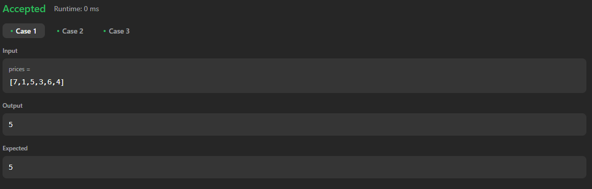

# 121. Best Time to Buy and Sell Stock

[Code Link](https://leetcode.com/problems/best-time-to-buy-and-sell-stock/description/)

<!-- [Youtube Link](https://www.youtube.com/watch?v=usxn9PV6Fdo&ab_channel=Technosage) -->

## Problem Statement

You are given an array `prices` where `prices[i]` is the price of a given stock on the `ith` day.

You want to maximize your profit by choosing a single day to buy one stock and choosing a different day in the future to sell that stock.

Return the maximum profit you can achieve from this transaction. If you cannot achieve any profit, return `0`.

## Code Solution

```java
class Solution {
    public int maxProfit(int[] prices) {
        int min=prices[0];
        int max=0;
        int n=prices.length;
        for(int i=1;i<n;i++){
            if(min>prices[i]){
                min=prices[i];
            }

            if(prices[i]-min>max){
                max=prices[i]-min;
            }
        }
        return max;
    }
}
```

## Output


