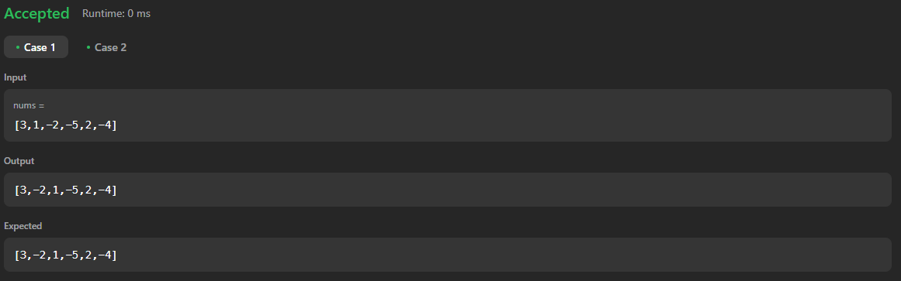

# 2149. Rearrange Array Elements by Sign

[Code Link](https://leetcode.com/problems/rearrange-array-elements-by-sign/description/)

<!-- [Youtube Link](https://www.youtube.com/watch?v=usxn9PV6Fdo&ab_channel=Technosage) -->

## Problem Statement

You are given a `0-indexed` integer array `nums` of even length consisting of an `equal` number of positive and negative integers.

You should return the array of nums such that the the array follows the given conditions:

1. Every `consecutive pair` of integers have opposite signs.
2. For all integers with the same sign, the order in which they were present in `nums` is preserved.
3. The rearranged array begins with a positive integer.
   </br>Return the modified array after rearranging the elements to satisfy the aforementioned conditions.

## Code Solution

```java
class Solution {
    public int[] rearrangeArray(int[] nums) {
        int j=0,k=0,n=nums.length,sp=0,sn=0;
        int answer[]=new int[n];
        int solutionP[] = new int[n];
        int solutionN[] = new int[n];
        for(int i=0;i<n;i++){
            if(nums[i]>=0){
                solutionP[j]=nums[i];
                // System.out.println("POsitive:"+solutionP[j]);
                j++;
            }
            if(nums[i]<0){
                solutionN[k]=nums[i];
                // System.out.println("Negative:"+solutionN[k]);
                k++;
            }
        }

                // System.out.println("j: "+j+" K: "+k);

        for(int i=0;i<n;i++){
            // System.out.println(solutionP[i]);
            if(i==0){
                // System.out.println(i+" Inside 0");
                answer[i]=solutionP[sp];
                sp++;
            }
            if(i%2!=0 && i!=0){
                answer[i]=solutionN[sn];
                // System.out.println(i+" Inside Odd and it should be negative answer[i]: "+ answer[i]+" solutiojn[i]:"+solutionN[sn]);
                sn++;
            }
             if(i%2==0 && i!=0){
                answer[i]=solutionP[sp];
                // System.out.println(i+" Inside Even and it should be Positive answer[i]: "+ answer[i]+" solutiojn[i]:"+solutionP[sp]);
                sp++;
            }

        }
        return answer;
    }
}
```

## Output


