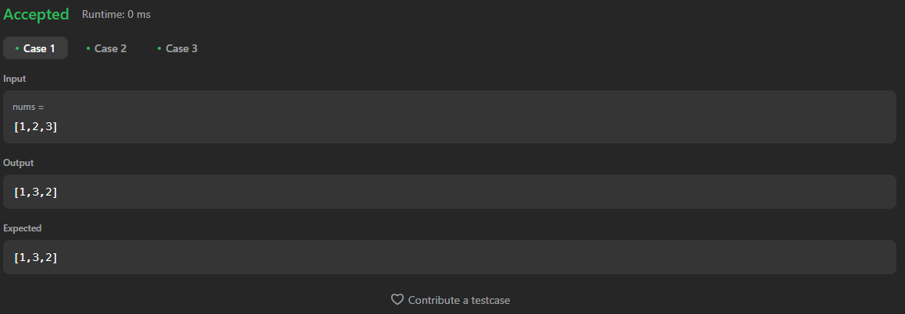

# 31. Next Permutation

[Code Link](https://leetcode.com/problems/rearrange-array-elements-by-sign/description/)

<!-- [Youtube Link](https://www.youtube.com/watch?v=usxn9PV6Fdo&ab_channel=Technosage) -->

## Problem Statement

A permutation of an array of integers is an arrangement of its members into a sequence or linear order.

For example, for `arr = [1,2,3]`, the following are all the permutations of `arr`:

- `[1,2,3]`
- `[1,3,2]`
- `[2,1,3]`
- `[2,3,1]`
- `[3,1,2]`
- `[3,2,1]`

The next permutation of an array of integers is the next lexicographically greater permutation of its integers. More formally, if all the permutations of the array are sorted in one container according to their lexicographical order, then the next permutation of that array is the permutation that follows it in the sorted container. If such an arrangement is not possible, the array must be rearranged as the lowest possible order (i.e., sorted in ascending order).

### Examples

1. The next permutation of `arr = [1,2,3]` is `[1,3,2]`.
2. The next permutation of `arr = [2,3,1]` is `[3,1,2]`.
3. The next permutation of `arr = [3,2,1]` is `[1,2,3]` because `[3,2,1]` does not have a lexicographical larger rearrangement.

### Problem Statement

Given an array of integers `nums`, find the next permutation of `nums`.

The replacement must be in place and use only constant extra memory.

### Code Solution

Here is an example of how to implement the solution in Java:

```java
class Solution {
    public void nextPermutation(int[] nums) {
        int n = nums.length;
        // If the array is null or has 1 or fewer elements, no need to change it
        if (nums == null || n <= 1)
            return;

        int i = n - 2;
        // Find the first decreasing element from the end of the array
        while (i >= 0 && nums[i] >= nums[i + 1])
            i--;

        // If such element was found
        if (i >= 0) {
            int j = nums.length - 1;
            // Find the next larger element to swap with nums[i]
            while (nums[j] <= nums[i])
                j--;
            // Swap the elements at positions i and j
            swap(nums, i, j);
        }

        // Reverse the elements after position i to get the next permutation
        reverse(nums, i + 1, nums.length - 1);
    }

    // Helper method to swap elements at positions i and j in the array
    public void swap(int arr[], int i, int j) {
        int temp = arr[i];
        arr[i] = arr[j];
        arr[j] = temp;
    }

    // Helper method to reverse elements in the array from position i to j
    public void reverse(int arr[], int i, int j) {
        // Swap elements while i is less than j
        while (i < j)
            swap(arr, i++, j--);
    }
}
```

## Output


