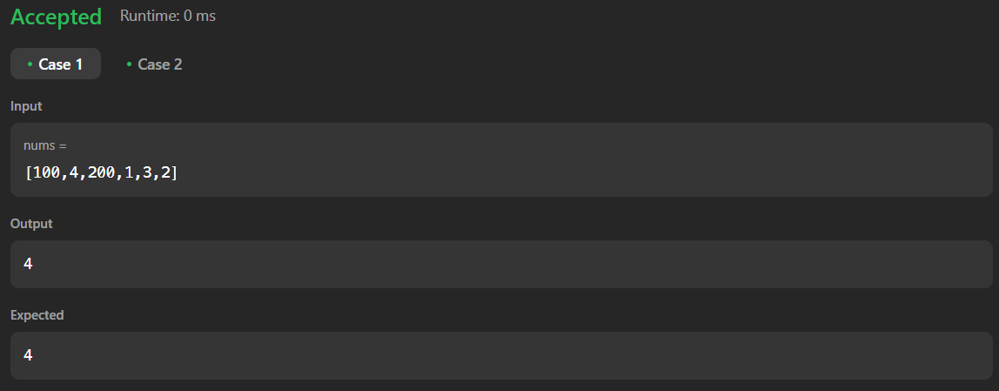

# 128. Longest Consecutive Sequence

[Code Link](https://leetcode.com/problems/longest-consecutive-sequence/description/)

## Problem Statement

Given an unsorted array of integers `nums`, return the length of the longest consecutive elements sequence.

You must write an algorithm that runs in O(n) time.

### Examples

**Example 1:**

- **Input:** `nums = [100, 4, 200, 1, 3, 2]`
- **Output:** `4`
- **Explanation:** The longest consecutive elements sequence is `[1, 2, 3, 4]`. Therefore its length is `4`.

**Example 2:**

- **Input:** `nums = [0, 3, 7, 2, 5, 8, 4, 6, 0, 1]`
- **Output:** `9`
- **Explanation:** The longest consecutive elements sequence is `[0, 1, 2, 3, 4, 5, 6, 7, 8]`. Therefore its length is `9`.

### Problem Statement

Given an array of integers `nums`, write a function to find the length of the longest consecutive elements sequence.

### Code Solution

Here is an example of how to implement the solution in Java:

```java
class Solution {
    public int longestConsecutive(int[] nums) {
        int n=nums.length;

        // Base Case
        if(n == 0  || n == 1) return n;

        // Initilize Data Structure
        PriorityQueue<Integer> pq = new PriorityQueue<>();

        for(int i=0;i<n;i++){
            pq.add(nums[i]);
        }

        int ans=1;
        int count=1;
        int prev=pq.remove();

        while(!pq.isEmpty()){
            // Present element
            int present=pq.remove();

            // Handeling Duplicate element
            if(present == prev){}

            // if previous element and current element having the difference of 1 then increment the count and check it with previous answer and change the
            else if(Math.abs(present-prev) == 1){
                count++;
                ans=Math.max(ans,count);
                prev=present;
            }
            // If current element is not matching the change the count back to one and change the present to previous
            else{
                count=1;
                prev=present;
            }
        }
            return ans;

    }
}
```

## Output


