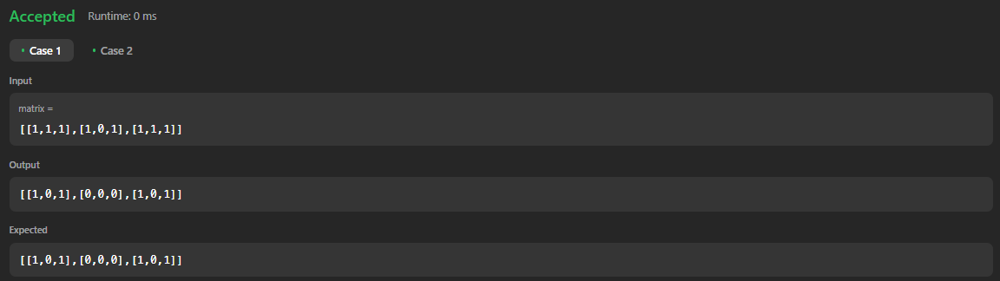

# 73. Set Matrix Zeroes

[Code Link](https://leetcode.com/problems/set-matrix-zeroes/description/)
[YouTube Link](https://www.youtube.com/watch?v=M65xBewcqcI&ab_channel=takeUforward)

## Problem Statement

Given an `m x n` integer matrix `matrix`, if an element is `0`, set its entire row and column to `0`'s.

### Code Solution

Here is an example of how to implement the solution in Java:

```java
class Solution {
    public void setZeroes(int[][] matrix) {
        int col0=1;
        int rows=matrix.length;
        int cols=matrix[0].length;

        for(int i=0; i<rows; i++){
            if(matrix[i][0] == 0)
                col0=0;
            for(int j=1; j<cols; j++)
                if(matrix[i][j] == 0)
                    matrix[i][0] = matrix[0][j] = 0;
        }

            for(int i=rows-1; i>=0; i--){
                for(int j=cols-1; j>=1; j--)
                    if(matrix[i][0] == 0 || matrix[0][j] == 0)
                        matrix[i][j]=0;
                if(col0==0) matrix[i][0]=0;

        }
    }
}
```

## Output


