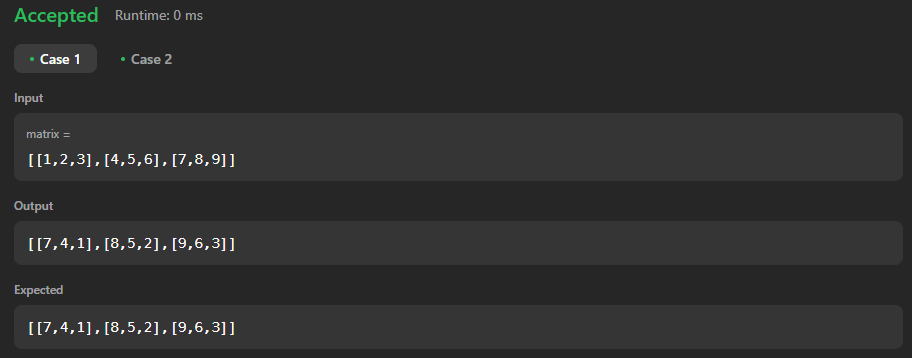

# 78. Rotate Image

[Code Link](https://leetcode.com/problems/rotate-image/)
</br>
[YouTube Link](https://www.youtube.com/watch?v=Ux058jpRB9Y&ab_channel=NikhilLohia)

## Problem Statement

You are given an `n x n` 2D `matrix` representing an image, rotate the image by `90` degrees (clockwise).

You have to rotate the image `in-place`, which means you have to modify the input 2D matrix directly. DO NOT allocate another 2D matrix and do the rotation.

### Code Solution

Here is an example of how to implement the solution in Java:

```java
class Solution {
    public void rotate(int[][] matrix) {
        int[][] answer=new int[matrix.length][matrix.length];
        int count=matrix[0].length-1;
        int n=matrix.length;

        for(int i=0;i<n;i++){
            for(int j=0;j<n;j++){
                answer[j][count]=matrix[i][j];
            }
            count--;
        }

        for(int i=0;i<n;i++){
            for(int j=0;j<n;j++){
                matrix[i][j]=answer[i][j];
            }
        }
    }
}
```

## Output


