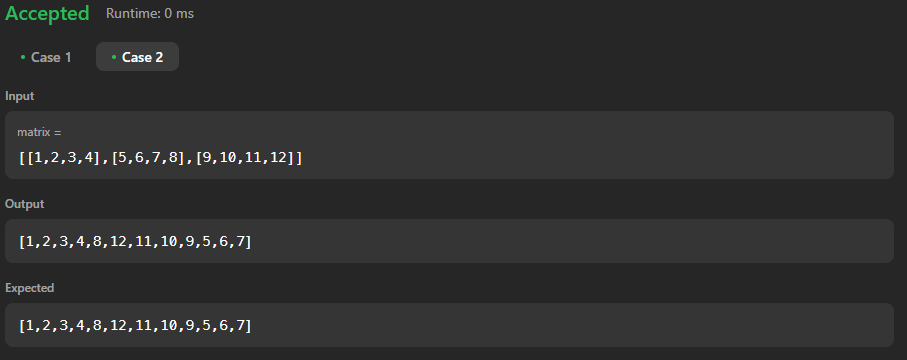

# 54. Spiral Matrix

[Code Link](https://leetcode.com/problems/spiral-matrix/description/)
</br>
[YouTube Link](https://www.youtube.com/watch?v=3Zv-s9UUrFM&ab_channel=takeUforward)

## Spiral Matrix Problem Description

Given an m x n matrix, return all elements of the matrix in spiral order.

### Examples

**Example 1:**

- **Input:**
  ```java
  matrix = [
    [1, 2, 3],
    [4, 5, 6],
    [7, 8, 9]
  ]
  ```
- **Output:** `[1, 2, 3, 6, 9, 8, 7, 4, 5]`

**Example 2:**

- **Input:**
  ```java
  matrix = [
    [1, 2, 3, 4],
    [5, 6, 7, 8],
    [9, 10, 11, 12]
  ]
  ```
- **Output:** `[1, 2, 3, 4, 8, 12, 11, 10, 9, 5, 6, 7]`

### Problem Statement

Given an m x n matrix, write a function to return all elements of the matrix in spiral order.

### Code Solution

Here is an example of how to implement the solution in Java:

```java
import java.util.ArrayList;
import java.util.List;

class Solution {
    public List<Integer> spiralOrder(int[][] matrix) {
        // Number of rows
        int n = matrix.length;

        // Number of columns
        int m = matrix[0].length;

        int left = 0;
        int right = m - 1;
        int top = 0;
        int bottom = n - 1;

        ArrayList<Integer> answer = new ArrayList<>();

        // Iterate while top row <= bottom row and left column <= right column
        while (top <= bottom && left <= right) {
            // Traverse from left to right on the topmost row
            for (int i = left; i <= right; i++)
                answer.add(matrix[top][i]);
            top++;

            // Traverse from top to bottom on the rightmost column
            for (int i = top; i <= bottom; i++)
                answer.add(matrix[i][right]);
            right--;

            // Traverse from right to left on the bottommost row, if rows are remaining
            if (top <= bottom) {
                for (int i = right; i >= left; i--)
                    answer.add(matrix[bottom][i]);
                bottom--;
            }

            // Traverse from bottom to top on the leftmost column, if columns are remaining
            if (left <= right) {
                for (int i = bottom; i >= top; i--)
                    answer.add(matrix[i][left]);
                left++;
            }
        }
        return answer;
    }
}
```

### Explanation

1. **Initialization:**

   - `n`: Number of rows in the matrix.
   - `m`: Number of columns in the matrix.
   - `left`, `right`: Represent the current leftmost and rightmost columns.
   - `top`, `bottom`: Represent the current topmost and bottommost rows.
   - `answer`: List to store the elements in spiral order.

2. **Loop through the matrix:**

   - Traverse from left to right on the topmost row.
   - Traverse from top to bottom on the rightmost column.
   - Traverse from right to left on the bottommost row (if any rows are remaining).
   - Traverse from bottom to top on the leftmost column (if any columns are remaining).

3. **Update bounds:**

   - After each traversal, update the `top`, `bottom`, `left`, and `right` bounds to move inward for the next layer of the spiral.

4. **Return the result:**
   - Return the `answer` list containing the elements in spiral order.

This approach ensures that all elements are visited in a spiral order with a time complexity of O(m \* n), where m is the number of rows and n is the number of columns.

## Output


