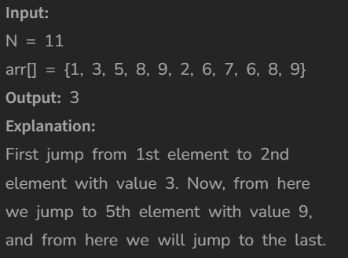

# Minimum number of jumps

[Code Link](https://www.geeksforgeeks.org/problems/minimum-number-of-jumps-1587115620/1)

## Problem Statement


## Code Solution

```java
class Solution{
    static int minJumps(int[] arr){
        int no=arr.length;

        // base condition
        if(no <= 1) return 0;

        // variable declaration
        int maxRange=0;
        int max=0;
        int jumps=0;

        // For loop
        for(int i=0;i<no;i++){

            // max between the current element and the array element added with the ith index
            max=Math.max(max,i+arr[i]);

            // if array position and max range matches
            if(maxRange==i){
                // the change the max range to the max
                maxRange=max;

                // increment the jump
                jumps++;
            }

            // if the addtition is greater than the no length then return thr jump
            if(maxRange>=no-1) return jumps;
        }


            return -1;
    }
}
```

## Output

!
