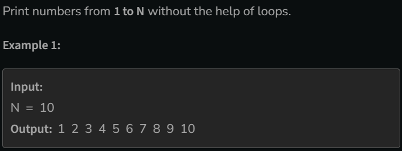

# Print 1 To N Without Loop

[Code Link](https://www.geeksforgeeks.org/problems/print-1-to-n-without-using-loops-1587115620/1?utm_source=youtube&utm_medium=collab_striver_ytdescription&utm_campaign=print-1-to-n-without-using-loops)

## Problem Statement



## Code Solution

```java
class Solution
{

  public void printNos(int N)
    {
        if(N==1){
            System.out.print(N+" ");
        }else{
            printNos(N-1);
            System.out.print(N+" ");
        }
    }
}
```
