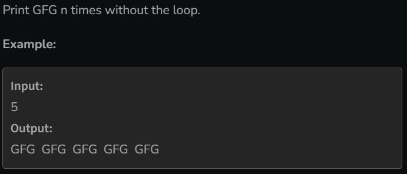

# Print GFG n times

[Code Link](https://www.geeksforgeeks.org/problems/print-gfg-n-times/1?utm_source=youtube&utm_medium=collab_striver_ytdescription&utm_campaign=print-gfg-n-times)

## Problem Statement



## Code Solution

```java
class Solution {

    void printGfg(int N) {
        if(N==1){
            System.out.print("GFG ");
        }else{
            printGfg(N-1);
            System.out.print("GFG ");
        }
    }
}
```
