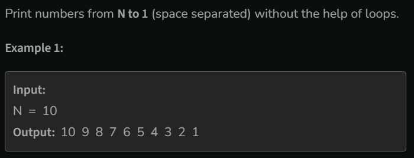

# Print N to 1 without loop

[Code Link](https://www.geeksforgeeks.org/problems/minimum-number-of-jumps-1587115620/1)

## Problem Statement



## Code Solution

```java
class Solution {

    void printNos(int N) {
        if(N==1){
            System.out.print(N+" ");
        }else{
            System.out.print(N+" ");
            printNos(N-1);
        }
    }
}
```
