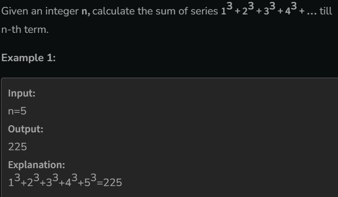

# Sum of first n terms

[Code Link](https://www.geeksforgeeks.org/problems/sum-of-first-n-terms5843/1)

## Problem Statement



## Code Solution

```java
class Solution {
    long sumOfSeries(long n) {
        long x=sum(n);
        return x;
    }
    
    public long sum(long N){
        if(N==1) return 1;
        long res=(long)Math.pow(N,3);
        return res+sum(N-1);
    }
}
```
