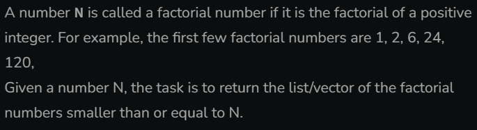
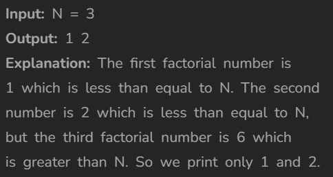

# Find all factorial numbers less than or equal to N

[Code Link](https://www.geeksforgeeks.org/problems/find-all-factorial-numbers-less-than-or-equal-to-n3548/0?problemType=functional&difficulty%255B%255D=-1&page=1&query=problemTypefunctionaldifficulty%255B%255D-1page1)

## Problem Statement



## Code Solution

```java
class Solution {
    static ArrayList<Long> factorialNumbers(long N){
        ArrayList<Long> result=new ArrayList();
        long factorial=1;
        for(long i=1;i<=N;i++){
            factorial*=i;
            if(factorial<=N) result.add(factorial);
            else break;
        }
        return result;
    }
}
```

## Output


