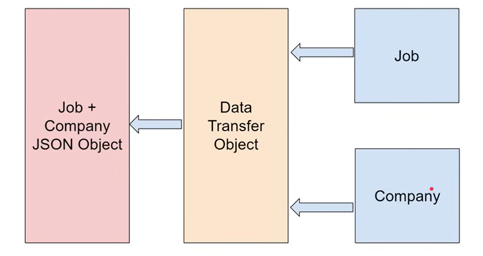

# InterService Communication
- Method Using which microservice in an app talk to each other.
- Ways to implement:
    - Synchronous:
        - Using HTTP based protocols like REST.
    - Asynchronous
        - Using Message Queues or Message Brokers like
            - RabbitMQ
            - Kafka
            - AWS SQS(Simple Queuing Service)

---

# Rest Template
- It is class in spring framework, that simplifies communication between microservices.
- Synchronous way of communication.
- Advantages:
    - Abstraction
    - Versatility
    - Conversion to desired datatype
    - Error Handling
    - Integration: well integrated in spring framework
```java
 RestTemplate rt = new RestTemplate();
        Company c = rt.getForObject("http://localhost:8081/companies/1", Company.class);
```

---

# DTO
- Design pattern used to transfer data between  software application subsystems.
- Example:
