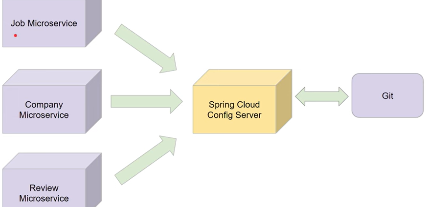

# Configuration Management
- Simply means managing and controlling the configurations of each microservice in the system
- Configuration may include details such as database connections, external service URLs, caching settings, and more
- *Challenge*: As the number of Microservices increases in your architecture, managing the individual configurations can become a complex task.
- A centralized Config Server provides a central place for managing configurations across all microservices
- It simplifies configuration management and increases operational efficiency.

### Features
- Centralized and Versioned Config
- Dynamic Updates
- Security
- Application and Profile Specific Config
- Single Source of truth
- Easier to manage and update config
- Enhances Security and control
- Easy to deploy and scale Microservices

---

# Spring Cloud Config Server
- Spring Cloud Config Server is part of the Spring Cloud project, a suite of tools specifically designed for building and managing cloud-native applications.

### Benefits
- Storing and Serving Configurations
- Refreshing Configurations
- Easy Integration with spring boot
- Support Different Env

